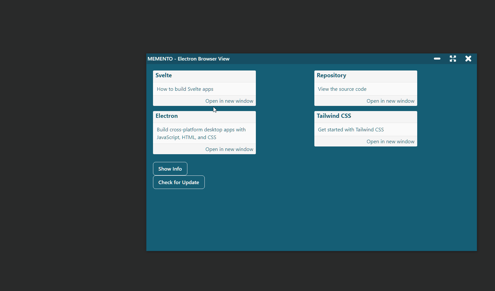

# MEMENTO - ELECTRON BROWSER VIEW



A template to show how to use [Browser View](https://www.electronjs.org/docs/latest/api/browser-view) in Electron. Based on (memento-svelte-electron-typescript)[https://github.com/el3um4s/memento-svelte-electron-typescript].

## Get Started

This is a project template for [Svelte](https://svelte.dev) and [Electron](https://www.electronjs.org/) apps. It lives at https://github.com/el3um4s/memento-electron-browser-view.

To create a new project based on this template using [degit](https://github.com/Rich-Harris/degit):

```bash
npx degit el3um4s/memento-electron-browser-view svelte-app
cd svelte-app
```

Then install the dependencies with

```bash
npm install
```

_Note that you will need to have [Node.js](https://nodejs.org) installed._

## Command

For development purpose:

- `npm run nodemon`: auto restart Electron on change
- `npm run dev`: auto reload the web page when you change Svelte files

For publish purpose:

- `npm run out:win`: create an exe file for Windows
- `npm run publish:win`: publish the app on GitHub

For test purpose:

- `npm run test`: test the app
- `npm run test:show-trace`: open the saved testing trace using [Playwright CLI](https://playwright.dev/docs/trace-viewer)
