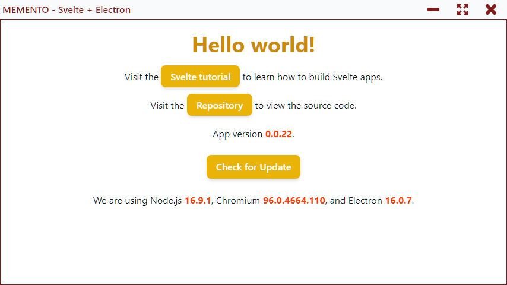

# MEMENTO - Svelte, TailwindCSS, Electron and TypeScript



Template to create a desktop app with Svelte, TailwindCSS, Electron and TypeScript (with electron-updater, electron-reload and electron-builder)

https://www.electronjs.org/docs/latest/api/browser-view
https://slack.engineering/growing-pains-migrating-slacks-desktop-app-to-browserview/
https://www.figma.com/blog/introducing-browserview-for-electron/
https://dev.to/thanhlm/electron-multiple-tabs-without-dealing-with-performance-2cma
https://github.com/itsderek23/electron-hybrid-browserview/blob/master/src/index.js
https://github.com/brrd/electron-tabs/blob/master/index.js
https://cameronnokes.com/blog/how-to-create-a-hybrid-electron-app/
https://stackoverflow.com/questions/38266951/how-to-create-chrome-like-tab-on-electron
https://stackoverflow.com/questions/46172471/electron-app-with-multiple-tabbed-browser-windows-connecting-to-https-sites
https://www.programmerall.com/article/65932048988/

## Get Started

This is a project template for [Svelte](https://svelte.dev) and [Electron](https://www.electronjs.org/) apps. It lives at https://github.com/el3um4s/memento-svelte-electron-typescript.

To create a new project based on this template using [degit](https://github.com/Rich-Harris/degit):

```bash
npx degit el3um4s/memento-svelte-electron-typescript svelte-app
cd svelte-app
```

Then install the dependencies with

```bash
npm install
```

_Note that you will need to have [Node.js](https://nodejs.org) installed._

## Command

For development purpose:

- `npm run nodemon`: auto restart Electron on change
- `npm run dev`: auto reload the web page when you change Svelte files

For publish purpose:

- `npm run out:win`: create an exe file for Windows
- `npm run publish:win`: publish the app on GitHub

For test purpose:

- `npm run test`: test the app
- `npm run test:show-trace`: open the saved testing trace using [Playwright CLI](https://playwright.dev/docs/trace-viewer)

## Notes

I'm blogging about the development process in these posts:

- [Svelte, Electron & TypeScript](https://www.patreon.com/posts/svelte-electron-52952074)
- [Electron and TypeScript: how to use ipcMain and ipcRenderer](https://www.patreon.com/posts/electron-and-how-53505039)
- [SvelteKit & Electron](https://www.patreon.com/posts/sveltekit-53840008)
